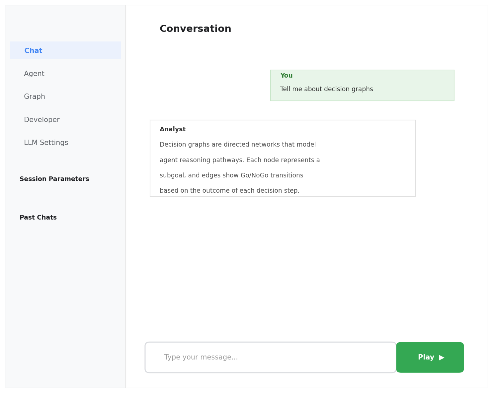
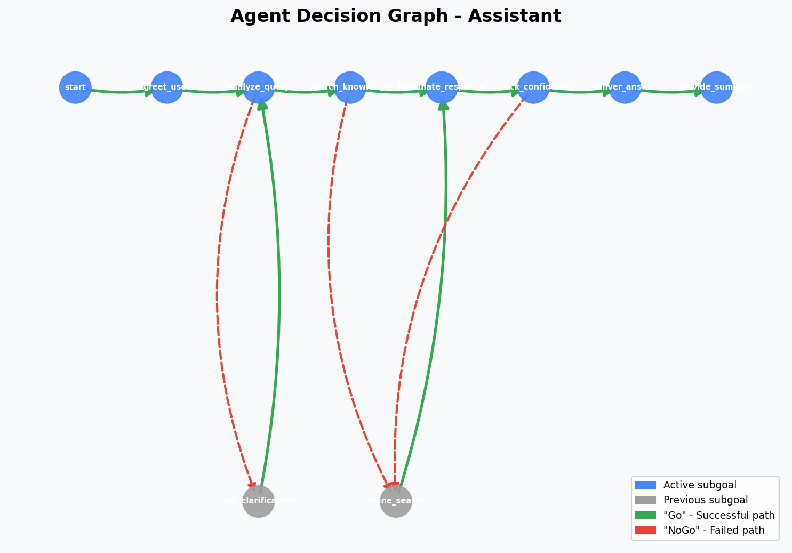
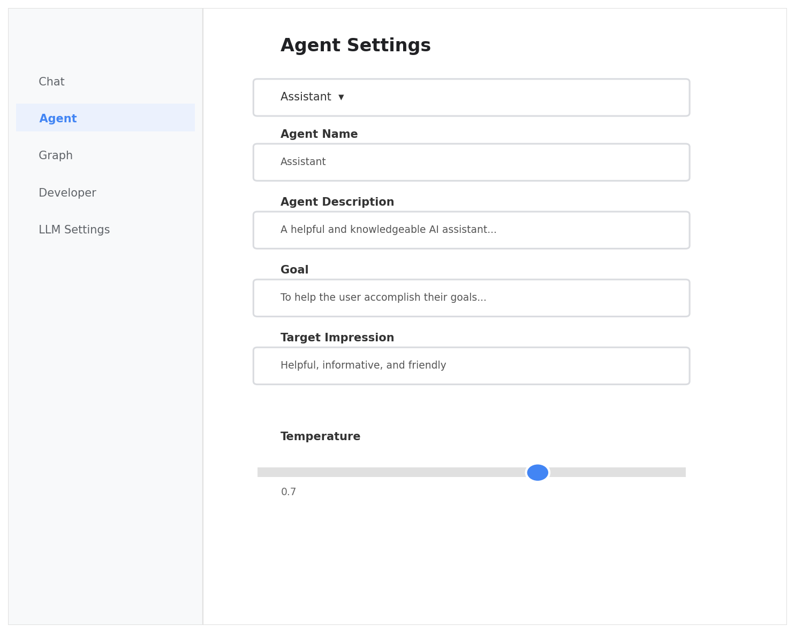

# GoalGraph

**Chat agents that map their pursuits through autonomous goal-setting**

An interactive multi-agent AI platform where agents pursue goals through conversation, with an LLM judge evaluating progress and a graph intelligence system that learns optimal paths over time.

Agents don't just chat — they work toward goals. A lightweight LLM judge rates each agent's progress on a 1–7 scale, triggering **Go** (goal achieved) or **NoGo** (abandon and retry) decisions that build a persistent decision graph. Over time, agents use sentence embeddings to find known paths through the graph toward their goals, avoiding previously failed approaches.

## Screenshots

### Chat Interface


### Graph Visualization


### Agent Settings


---

## Table of Contents

- [How It Works](#how-it-works)
  - [Goal-Directed Agent Loop](#goal-directed-agent-loop)
  - [The Decision Graph — Technical Detail](#the-decision-graph--technical-detail)
  - [Graph Intelligence](#graph-intelligence)
  - [Persistence & Patience](#persistence--patience)
- [Features](#features)
  - [Conversation Modes](#conversation-modes)
  - [Agent Library & Per-Agent LLM Configuration](#agent-library--per-agent-llm-configuration)
  - [Graph Library — Save, Visualize, and Merge](#graph-library--save-visualize-and-merge)
  - [Multi-Provider LLM Support](#multi-provider-llm-support)
  - [Session Management](#session-management)
  - [Developer Tools](#developer-tools)
- [Architecture](#architecture)
- [Project Structure](#project-structure)
- [Getting Started](#getting-started)
- [API Reference](#api-reference)
- [License](#license)

---

## How It Works

### Goal-Directed Agent Loop

Each generation cycle follows this flow:

1. **Subgoal Assignment** — If the agent has no active subgoal, the system first checks the decision graph for a known path (via embedding similarity search). If no path exists, the LLM generates a new subgoal, informed by previously failed approaches (NoGo nodes in the graph).

2. **Response Generation** — The agent generates an in-character response with its subgoal and suggested action as context. Responses include optional narration (deduplicated against the last narration to avoid repetition using a >20% similarity threshold).

3. **LLM Judge Review** — A lightweight LLM call rates goal progress on a 1–7 Likert scale:
   - Rating >= 6 → **Go**: Subgoal achieved. A Go edge is created in the graph.
   - Rating <= 2 → **NoGo**: Strong failure. The subgoal is abandoned (after minimum persistence turns).
   - Score regression > 1 point *and* rating <= 4 → **NoGo**: Progress is going backwards.
   - Exceeded patience limit → **NoGo**: Agent has been stuck too long; forced abandonment.

4. **Graph Update** — Go/NoGo decisions create weighted, directed edges in the agent's decision graph. The edge weight equals `persistence_count` (the number of turns the agent spent on that subgoal), which also determines visual distance in the graph rendering.

```
                        ┌──────────────┐
                        │  Start Node  │
                        └──────┬───────┘
                               │
                    ┌──────────▼──────────┐
                    │  Generate Subgoal   │◄──── Check graph for known path
                    │  (or use known path)│      (embedding similarity search)
                    └──────────┬──────────┘
                               │
                    ┌──────────▼──────────┐
                    │  Agent Response     │◄──── Subgoal + suggestion in prompt
                    │  (LLM generation)   │
                    └──────────┬──────────┘
                               │
                    ┌──────────▼──────────┐
                    │  LLM Judge Review   │──── Rating 1-7
                    │  (progress score)   │
                    └──────┬─────┬────────┘
                           │     │
                  Rating≥6 │     │ Rating≤2 or
                  (Go)     │     │ regression/timeout
                           │     │ (NoGo)
                    ┌──────▼─┐ ┌─▼────────────┐
                    │Go Edge │ │NoGo Edge      │
                    │→ next  │ │→ {goal}_NoGo  │
                    │subgoal │ │  (try again)  │
                    └────────┘ └───────────────┘
```

### The Decision Graph — Technical Detail

Each agent maintains its own **directed graph** (NetworkX `DiGraph`) stored as a GraphML file. The graph is the core data structure that makes agents learn from experience.

#### Node Types

| Node Type | Example | Meaning |
|-----------|---------|---------|
| `start` | `start` | Initial node. Every graph begins here. |
| Subgoal node | `negotiate 50% discount` | A successfully reached intermediate goal. |
| NoGo node | `negotiate 50% discount_NoGo` | A failed approach — explicitly recorded to prevent re-attempting. |

#### Edge Types

| Edge Label | Direction | Weight | Meaning |
|------------|-----------|--------|---------|
| `Go` | `current_node` → `subgoal_text` | `persistence_count` | Successful progression. The agent achieved this subgoal in N turns. |
| `NoGo` | `current_node` → `{subgoal}_NoGo` | `persistence_count` | Failed approach. The agent tried N turns and gave up. |
| `Similar` | Bidirectional | `0.1` | Semantic link between nodes with cosine similarity > 0.8. Created during graph merge operations. |

#### Edge Weight Semantics

The edge weight has a dual purpose:

1. **As a record**: It captures how many conversation turns the agent spent pursuing that subgoal. Lower weight = the agent achieved it quickly. Higher weight = it took more effort.
2. **For pathfinding**: When searching for routes through the graph, edge weight determines cost. NoGo edges are penalized 10x, so the pathfinder strongly prefers successful (Go) routes.
3. **For visualization**: PyVis renders edge length as `weight × 100`, so quick wins cluster tightly and hard-fought subgoals spread out visually.

#### Graph Lifecycle

```
Agent Created → Empty graph with 'start' node
       │
       ▼
First Subgoal → LLM generates subgoal (no graph history to reference)
       │
       ▼
After N turns → Judge rates progress → Go or NoGo edge created
       │
       ▼
Next Subgoal → System checks graph: "Is there a known path from here to the goal?"
       │         ├── Yes: Follow known path (next node = next subgoal)
       │         └── No: LLM generates new subgoal (informed by NoGo history)
       ▼
Graph grows with each conversation cycle...
       │
       ▼
Graph can be saved to library, merged with other agents' graphs, or imported
```

### Graph Intelligence

The decision graph isn't just a record — it's reusable knowledge.

#### Semantic Search (`find_path_to_goal`)

Node labels are embedded with `all-MiniLM-L6-v2` (sentence-transformers). When an agent needs a new subgoal:

1. All node labels in the graph are batch-encoded into 384-dimensional embeddings (cached for efficiency).
2. The agent's goal text is embedded.
3. Cosine similarity identifies the graph node most semantically similar to the goal.
4. `nx.shortest_path` routes from the agent's current node to the target, weighting by `persistence_count` and penalizing NoGo edges 10×.
5. The next node on that path becomes the agent's new subgoal.

This means agents can recognize when a previously successful strategy applies to a new situation, even when the exact wording differs.

#### Graph Import

One agent's graph can be imported into another agent's graph:
- Optional **namespace prefix** avoids node name collisions (e.g., `alex::negotiate discount` vs `jordan::negotiate discount`).
- When edges collide, the lower-weight (more efficient) edge is kept.
- The embedding cache is updated after import.

#### Graph Merge

Multiple graphs can be combined into a single shared knowledge graph:
- All nodes and edges from each source graph are composed using `nx.compose`.
- The merged graph is saved with metadata tracking its source graphs.
- Useful for studying collective agent behavior or bootstrapping new agents with combined knowledge.

#### Similarity Linking

After a merge, `link_similar_nodes()` can connect semantically equivalent nodes across subgraphs:
- Pairwise cosine similarities are computed between all node embeddings.
- Pairs exceeding a threshold (default 0.8) get bidirectional edges with label `Similar` and weight `0.1`.
- This enables pathfinding *across* previously separate agent experiences, even when node names don't match exactly.

### Persistence & Patience

Each agent has configurable persistence parameters that control how long it pursues a subgoal before giving up:

| Parameter | Default | Description |
|-----------|---------|-------------|
| `persistance` | 3 | Minimum turns before a NoGo can trigger, even on bad scores. Gives the agent a fair chance. |
| `patience` | 6 | Maximum turns before a forced NoGo, regardless of score. Prevents infinite loops. |
| `persistance_count` | 0 (resets) | Tracks attempts on the current subgoal. Becomes the edge weight on Go/NoGo. |
| `persistance_score` | 4 (resets) | The LLM judge's latest rating (1–7). Used to detect regression. |

**Decision logic each turn:**
- If `persistance_count < persistance`: Agent continues regardless of score (building patience).
- If rating >= 6: **Go** — subgoal achieved.
- If rating <= 2 and `persistance_count >= persistance`: **NoGo** — clear failure.
- If `persistance_score - rating > 1` and rating <= 4: **NoGo** — regression detected.
- If `persistance_count > patience`: **NoGo** — timeout, agent has been stuck too long.

---

## Features

### Conversation Modes

The platform supports two conversation modes, selected when creating a new chat:

**You + Agent** — Chat directly with one AI agent. You provide messages; the agent responds in character while pursuing its goal. The agent's subgoal system, LLM judge, and graph all operate behind the scenes.

**Agent vs Agent** — Watch two or more agents converse with each other. You act as a "narrator," providing scene-setting context. Each agent takes turns responding, each pursuing their own goal with their own decision graph. This mode is designed for studying multi-agent negotiation, debate, and emergent behavior.

### Agent Library & Per-Agent LLM Configuration

The **Agent Library** lets you create reusable agent presets with:

| Field | Purpose |
|-------|---------|
| **Agent Name** | Display name in conversations |
| **Description** | Personality, character background, behavioral traits |
| **Goal** | The agent's objective — what it's trying to achieve in conversation |
| **Target Impression** | How the agent wants to be perceived by others |
| **LLM Provider** | Which AI provider to use (OpenAI, Anthropic, Cohere, etc.) |
| **Model** | Specific model within that provider |

**Per-agent LLM configuration** means you can pit different models against each other in the same conversation. For example:
- **Jordan** uses `claude-sonnet-4-20250514` (Anthropic)
- **Alex** uses `gpt-5.1-codex-mini` (OpenAI)

When an agent has a custom provider/model set, its `is_agent_generation_variables` flag is `true`, and the system routes that agent's LLM calls through its own provider instead of the session default.

### Graph Library — Save, Visualize, and Merge

The **Graph** tab provides a complete graph management interface:

#### Active Agent Graphs
- View any active agent's current decision graph rendered as an interactive PyVis visualization.
- Nodes are draggable; the physics simulation uses Barnes-Hut gravity.
- Blue nodes = active/successful subgoals. Grey nodes = failed (NoGo) approaches.
- Save an agent's graph to the library for later reuse.

#### Saved Graphs
- Browse all saved graphs with metadata (node count, edge count, source agent).
- **Visualize** any saved graph in the embedded viewer.
- **Select multiple graphs** (checkboxes) to enable the **Merge** operation.
- **Delete** graphs you no longer need.

#### Merge Workflow
1. Check two or more saved graphs.
2. Click "Merge Selected (N)".
3. Enter a name for the merged graph.
4. Click "Confirm Merge" — the system combines all nodes/edges via `nx.compose` and saves the result as a new graph.

The inline legend appears inside the graph viewer when a graph is displayed, showing node types (active subgoal, previous subgoal) and edge types (Go/success, NoGo/fail).

### Multi-Provider LLM Support

The platform abstracts LLM access through a unified service layer with automatic fallback:

| Provider | Models | Auth |
|----------|--------|------|
| **OpenAI** | GPT-4o, GPT-4o Mini, GPT-4 Turbo, GPT-3.5 Turbo | `OPENAI_API_KEY` |
| **OpenAI Codex** | GPT-5.1-codex-mini, GPT-5.1, GPT-5.2 variants | `~/.codex/auth.json` (ChatGPT Plus/Pro OAuth) |
| **Anthropic** | Claude Sonnet 4, Claude 3.5 Sonnet, Claude 3.5 Haiku | `ANTHROPIC_API_KEY` |
| **Cohere** | Command R+, Command R | `COHERE_API_KEY` |
| **HuggingFace** | Mistral 7B Instruct | `HUGGINGFACE_API_KEY` |
| **Local** | Any GGUF model via llama_cpp | Local file path |

**Fallback chain**: If the primary provider fails, the system tries openai-codex → openai → anthropic → cohere → local, in order.

**Rate limiting**: Automatic retry with exponential backoff (2s, 4s, 8s, 16s) for 429 errors, with Retry-After header support.

**Generation parameters** (configurable per-session or per-agent):
- `temperature` (0.0–2.0) — Response randomness
- `max_tokens` — Output length limit
- `top_p` — Nucleus sampling
- `seed` — For reproducibility
- `use_gpu` — Hardware acceleration for local models

### Session Management

- **Create** new chat sessions with configured agents via the New Chat dialog.
- **Duplicate** a session to branch from the current state.
- **Reset** a session (clears history, keeps agents configured).
- **Delete** sessions with inline confirmation (no browser popups).
- **Load** past sessions from the sidebar.
- **File-based storage**: Each session is saved as `{session_id}_state.json` in `chat_cache/`, containing the full conversation history, agent states, graph file paths, and configuration. This makes sessions portable and inspectable.

### Developer Tools

The Developer tab provides real-time debugging:
- **Session Debug Info**: Full JSON dump of the current session state (agents, settings, generation state).
- **Logs**: Server-side log output.
- **Auto-refresh**: Configurable polling interval (default 3s).
- **Download/Clear**: Export or reset logs.

---

## Architecture

```
┌─────────────────────────────────────────────────────────────┐
│                      Frontend (React 17)                     │
│  ┌──────────┐ ┌──────────┐ ┌──────────┐ ┌───────────────┐  │
│  │   Chat   │ │  Agent   │ │  Graph   │ │   Developer   │  │
│  │Interface │ │ Library  │ │ Library  │ │    Tools      │  │
│  └────┬─────┘ └────┬─────┘ └────┬─────┘ └───────┬───────┘  │
│       │             │            │               │           │
│  ┌────▼─────────────▼────────────▼───────────────▼───────┐  │
│  │              SessionContext (React Context API)         │  │
│  └────────────────────────┬──────────────────────────────┘  │
│                           │  api.js                          │
└───────────────────────────┼──────────────────────────────────┘
                            │ HTTP/JSON
┌───────────────────────────┼──────────────────────────────────┐
│                     Backend (Flask + Waitress)                │
│                           │                                   │
│  ┌────────────────────────▼──────────────────────────────┐   │
│  │                    app.py (Routes)                      │   │
│  │  /submit  /generate  /api/agent_library  /api/saved_*  │   │
│  └──────┬────────────┬──────────────────┬────────────────┘   │
│         │            │                  │                     │
│  ┌──────▼──────┐ ┌───▼────────────┐ ┌──▼──────────────┐     │
│  │  agent.py   │ │graph_intel.py  │ │ llm_service.py  │     │
│  │  Subgoals   │ │  Embeddings    │ │  Multi-provider │     │
│  │  Go/NoGo    │ │  Pathfinding   │ │  Retry/fallback │     │
│  │  Judge loop │ │  Import/Merge  │ │  Rate limiting  │     │
│  └──────┬──────┘ └───┬────────────┘ └──┬──────────────┘     │
│         │            │                  │                     │
│  ┌──────▼────────────▼──────────────────▼────────────────┐   │
│  │           NetworkX DiGraph + GraphML Files             │   │
│  │           Session JSON + Agent Library JSON            │   │
│  └───────────────────────────────────────────────────────┘   │
└──────────────────────────────────────────────────────────────┘
```

**Key technologies:**
- **Frontend**: React 17 + Webpack 5, Context API for state management, Lucide icons
- **Backend**: Flask + Waitress WSGI server
- **LLM Integration**: Abstraction layer supporting multiple providers with retry, fallback, and per-agent routing
- **Graph Engine**: NetworkX directed graphs + sentence-transformers embeddings (`all-MiniLM-L6-v2`)
- **Graph Visualization**: PyVis (interactive HTML) served via iframe
- **Session Storage**: File-based JSON in `chat_cache/`

## Project Structure

```
thinking-agents/
├── src/
│   ├── app.py                      # Flask application server (routes, session mgmt)
│   ├── defaults_session.json        # Default session/agent configuration template
│   ├── index.js                     # React entry point
│   ├── webpack.config.js            # Webpack build configuration
│   ├── package.json                 # Frontend dependencies
│   ├── agent/
│   │   ├── agent.py                 # Core agent logic: subgoals, LLM judge, Go/NoGo loop
│   │   ├── graph_intelligence.py    # Embedding search, pathfinding, graph import/merge/linking
│   │   ├── llm_service.py           # Multi-provider LLM abstraction with retry and fallback
│   │   └── schemas.py               # JSON schemas for agent responses, judge ratings, subgoals
│   ├── components/
│   │   ├── App.js                   # Main App component with tab routing
│   │   ├── Sidebar.jsx              # Sidebar navigation and past chats
│   │   ├── ChatInterface.js         # Chat UI with play/pause/send and inline confirmations
│   │   ├── AgentSettings.js         # Per-session agent configuration
│   │   ├── AgentLibrary.js          # Reusable agent presets with per-agent LLM settings
│   │   ├── NewChatDialog.js         # Multi-step dialog: mode → agents → graphs → start
│   │   ├── GraphLibrary.js          # Graph viewer, saved graphs, merge controls
│   │   ├── GraphView.js             # Graph visualization (PyVis iframe wrapper)
│   │   ├── DeveloperTools.js        # Debug info and log viewer
│   │   ├── LLMSettings.jsx          # Global LLM provider/model configuration
│   │   └── common/                  # Reusable UI components
│   │       ├── Button.jsx
│   │       ├── Dropdown.jsx
│   │       ├── Modal.jsx
│   │       └── Slider.jsx
│   ├── contexts/
│   │   ├── SessionContext.jsx        # Global session state (React Context)
│   │   └── AgentContext.jsx          # Agent-specific state
│   ├── services/
│   │   ├── api.js                   # Backend API communication layer
│   │   ├── graphService.js          # Graph visualization helpers
│   │   ├── llmApiService.js         # Frontend LLM API helpers
│   │   ├── llmService.js            # Frontend LLM service
│   │   └── sessionService.js        # Session handling
│   ├── styles/
│   │   └── main.css                 # Component styles
│   ├── static/                      # Built assets (bundle.js, main.css, graph HTML files)
│   └── chat_cache/                  # Runtime data (sessions, graphs, agent presets)
│       ├── agent_library/           # Saved agent presets (JSON)
│       ├── graphs/                  # Active agent graph files (GraphML)
│       └── saved_graphs/            # Saved/merged graph library (GraphML + metadata JSON)
├── screenshots/                     # README screenshots
├── requirements.txt                 # Python dependencies
└── .gitignore
```

## Getting Started

### Prerequisites

- Python 3.8+
- Node.js 14+ and npm
- An API key for at least one LLM provider (OpenAI, Anthropic, Cohere, or HuggingFace)

### Installation

1. Clone the repository:
   ```bash
   git clone https://github.com/maracman/thinking-agents.git
   cd thinking-agents  # GoalGraph
   ```

2. Set up a Python virtual environment and install dependencies:
   ```bash
   python -m venv venv
   source venv/bin/activate   # On Windows: venv\Scripts\activate
   pip install -r requirements.txt
   ```

3. Install frontend dependencies and build:
   ```bash
   cd src
   npm install
   npx webpack --config webpack.config.js --mode development
   cd ..
   ```

4. Set up environment variables:
   ```bash
   # At least one API key is required for live mode
   export OPENAI_API_KEY=your_openai_key
   export ANTHROPIC_API_KEY=your_anthropic_key
   # Optional
   export COHERE_API_KEY=your_cohere_key
   export HUGGINGFACE_API_KEY=your_huggingface_key
   ```

### Running the Application

```bash
cd src
python app.py
```

Open your browser to `http://localhost:5000`.

To run in offline mode (simulated responses, no API key needed):

```bash
cd src
OFFLINE_MODE=true python app.py
```

### Quick Start Guide

1. **Create agent presets** in the **Agent** tab — give each a name, description, goal, and optionally a per-agent LLM provider/model.
2. Click **New Chat** in the sidebar to open the chat creation dialog.
3. Choose a mode (**You + Agent** or **Agent vs Agent**), select your agents, and optionally assign existing graphs.
4. In the chat, type a message and click **Send**, or click **Play** to let agents generate responses automatically.
5. Watch the **Graph** tab as agents build their decision graphs over time.
6. **Save** interesting graphs to the library for reuse or merging.

## API Reference

### Core Routes

| Method | Route | Description |
|--------|-------|-------------|
| GET | `/get_session_id` | Get or create a session ID |
| GET | `/check_session` | Get current session state |
| POST | `/submit` | Submit a user message and optionally start generation |
| GET | `/generate` | Generate the next agent response (one turn) |
| POST | `/interrupt` | Stop the current generation loop |

### Agent Management

| Method | Route | Description |
|--------|-------|-------------|
| GET | `/get_agents` | List all agents in the current session |
| POST | `/add_agent` | Add or update an agent |
| POST | `/delete_agent` | Delete an agent |
| POST | `/toggle_agent_mute` | Mute/unmute an agent in conversations |

### Agent Library (Presets)

| Method | Route | Description |
|--------|-------|-------------|
| GET | `/api/agent_library` | List all saved agent presets |
| POST | `/api/agent_library` | Create a new agent preset |
| PUT | `/api/agent_library/<preset_id>` | Update an existing preset |
| DELETE | `/api/agent_library/<preset_id>` | Delete a preset |

### Graph Operations

| Method | Route | Description |
|--------|-------|-------------|
| GET | `/get_agent_graphs` | List active agents with graph info (node/edge counts) |
| GET | `/visualize_pyvis?agent_id=X` | Generate PyVis HTML visualization for an agent's graph |
| GET | `/graph_info/<agent_id>` | Get detailed graph stats, nodes, edges, and path-to-goal |
| POST | `/import_graph` | Import one agent's graph into another |
| POST | `/combine_graphs` | Merge multiple agents' graphs |

### Saved Graph Library

| Method | Route | Description |
|--------|-------|-------------|
| GET | `/api/saved_graphs` | List all saved graphs with metadata |
| POST | `/api/saved_graphs/from_agent/<agent_id>` | Save an agent's current graph to the library |
| GET | `/api/saved_graphs/<graph_id>/visualize` | Generate PyVis visualization for a saved graph |
| POST | `/api/saved_graphs/merge` | Merge multiple saved graphs into a new one |
| DELETE | `/api/saved_graphs/<graph_id>` | Delete a saved graph |

### LLM Configuration

| Method | Route | Description |
|--------|-------|-------------|
| GET | `/get_llm_providers` | List available LLM providers |
| GET | `/get_llm_models?provider=X` | List models for a provider |
| POST | `/update_llm_settings` | Update session-level LLM settings |
| POST | `/set_api_key` | Set an API key for a provider |

### Session Management

| Method | Route | Description |
|--------|-------|-------------|
| GET | `/get_past_chats` | List saved chat sessions |
| POST | `/create_new_chat` | Create a new empty chat session |
| POST | `/create_configured_chat` | Create a chat with specific agents, mode, and graphs |
| POST | `/duplicate_chat` | Duplicate the current session |
| POST | `/delete_chat` | Delete the current session |
| POST | `/reset` | Reset the current chat (clear history, keep agents) |
| POST | `/load_chat/<chat_id>` | Load a previous session |

---

## For Researchers

### Reproducibility

- Set `seed` in generation variables for deterministic LLM outputs (where supported by the provider).
- Session state files in `chat_cache/` contain the complete conversation history, agent configurations, and graph file paths — everything needed to reconstruct an experiment.
- Graph files (GraphML) can be loaded into any NetworkX-compatible tool for offline analysis.

### Analyzing Agent Behavior

- **Graph structure** reveals the agent's decision-making process: which subgoals were attempted, which succeeded (Go edges), which failed (NoGo edges), and how many turns each took (edge weight).
- **Edge weight distribution** shows efficiency — lower weights mean the agent achieved subgoals quickly.
- **NoGo node clustering** indicates areas where agents consistently struggle.
- **Merged graphs** across multiple runs reveal robust strategies vs. fragile ones.

### Customization Points

- `persistance` and `patience` parameters control the explore/exploit tradeoff. Lower persistence = more exploration (agents give up faster and try new approaches). Higher patience = more exploitation (agents commit longer to each approach).
- `temperature` affects response diversity. Lower = more deterministic strategies. Higher = more creative but less consistent.
- The LLM judge prompt (in `schemas.py`) can be modified to change evaluation criteria.
- Embedding model (`all-MiniLM-L6-v2`) can be swapped for domain-specific embeddings by modifying `graph_intelligence.py`.

---

## License

MIT License

Copyright (c) 2025 Marcus Anderson

Permission is hereby granted, free of charge, to any person obtaining a copy
of this software and associated documentation files (the "Software"), to deal
in the Software without restriction, including without limitation the rights
to use, copy, modify, merge, publish, distribute, sublicense, and/or sell
copies of the Software, and to permit persons to whom the Software is
furnished to do so, subject to the following conditions:

The above copyright notice and this permission notice shall be included in all
copies or substantial portions of the Software.

THE SOFTWARE IS PROVIDED "AS IS", WITHOUT WARRANTY OF ANY KIND, EXPRESS OR
IMPLIED, INCLUDING BUT NOT LIMITED TO THE WARRANTIES OF MERCHANTABILITY,
FITNESS FOR A PARTICULAR PURPOSE AND NONINFRINGEMENT. IN NO EVENT SHALL THE
AUTHORS OR COPYRIGHT HOLDERS BE LIABLE FOR ANY CLAIM, DAMAGES OR OTHER
LIABILITY, WHETHER IN AN ACTION OF CONTRACT, TORT OR OTHERWISE, ARISING FROM,
OUT OF OR IN CONNECTION WITH THE SOFTWARE OR THE USE OR OTHER DEALINGS IN THE
SOFTWARE.
